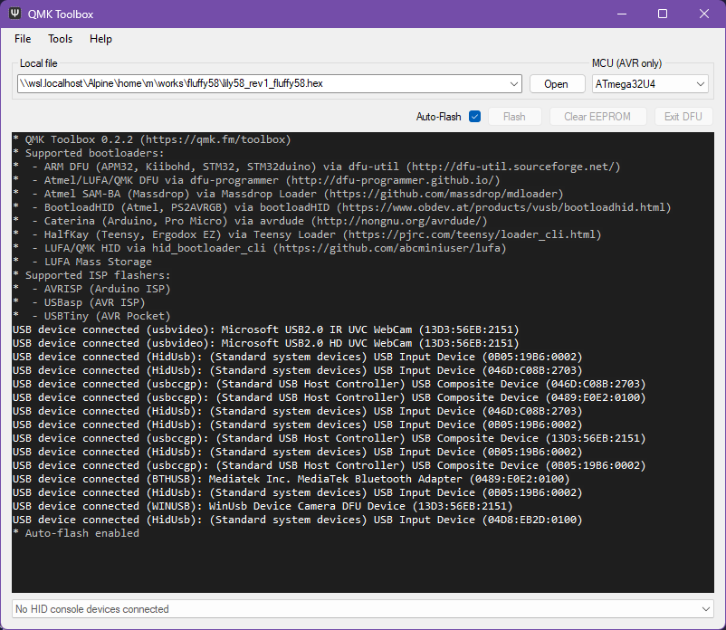

# fluffy58

an approachable 60%-like QMK keymap for the [Lily58 Pro RE](https://github.com/kissetfall/Lily58-Pro-RE)

- [layout](#layout)
- [make it yours](#make-it-yours)
- [building](#building)
- [flashing](#flashing)

## layout

- encoder controls:

  - **left encoder**
    - clockwise rotation: mouse down
    - counter-clockwise rotation: mouse up
    - press (default layer): `[`
    - press (lower layer): reset

  - **right encoder**
    - clockwise rotation: volume down
    - counter-clockwise rotation: volume up
    - press (default layer): `]`
    - press (lower layer): reset

- default qwerty layer:

  ```text
  ,-----------------------------------------.                    ,-----------------------------------------.
  | ESC  |   1  |   2  |   3  |   4  |   5  |                    |   6  |   7  |   8  |   9  |   0  |  `   |
  |------+------+------+------+------+------|                    |------+------+------+------+------+------|
  | Tab  |   Q  |   W  |   E  |   R  |   T  |                    |   Y  |   U  |   I  |   O  |   P  |  -   |
  |------+------+------+------+------+------|                    |------+------+------+------+------+------|
  |LShift|   A  |   S  |   D  |   F  |   G  |-------.    ,-------|   H  |   J  |   K  |   L  |   ;  |  '   |
  |------+------+------+------+------+------|   [   |    |    ]  |------+------+------+------+------+------|
  |LCTRL |   Z  |   X  |   C  |   V  |   B  |-------|    |-------|   N  |   M  |   ,  |   .  |   /  |RShift|
  `-----------------------------------------/       /     \      \-----------------------------------------'
                  |LOWER | LGUI | LAlt | /Space  /       \Space \  |Enter | RAlt |LOWER |
                  |      |      |      |/       /         \      \ |      |      |      |
                  `----------------------------'           '------''--------------------'
  ```

- lower layer:

```text
,-----------------------------------------.                    ,-----------------------------------------.
|  F1  |  F2  |  F3  |  F4  |  F5  |  F6  |                    |  F7  |  F8  |  F9  | F10  | F11  | DEL  |
|------+------+------+------+------+------|                    |------+------+------+------+------+------|
| F12  |  M1  | MUp  |  M2  |      |      |                    |      |  Up  |      |   7  |   8  |   9  |
|------+------+------+------+------+------|                    |------+------+------+------+------+------|
|CapsLk|MLeft |Mdown |MRight|      |      |-------.    ,-------| Left | Down |Right |   4  |   5  |   6  |
|------+------+------+------+------+------| Reset |    | Reset |------+------+------+------+------+------|
|LCTRL |MAccl0|MAccl1|MAccl3|      |      |-------|    |-------|      |      |      |   1  |   2  |   3  |
`-----------------------------------------/       /     \      \-----------------------------------------'
                |      | APP  | LAlt | /       /       \      \  |      | RAlt |   0  |
                |      |      |      |/       /         \      \ |      |      |      |
                `----------------------------'           '------''--------------------'
```

## make it yours

this keymap is very bare bones, because that's all I need. there's no userspace here.

want underglow? rgb? look around for a config you like and add their respective sections
to `config.h`, `keymap.c` and `rules.mk`.

## building

you will need and [qmk-cli](https://docs.qmk.fm/#/newbs_getting_started?id=set-up-your-environment).

```shell
make
```

nix/devbox users can use devbox to build the keymap:

```shell
devbox run make
```

## flashing

> [!WARNING]
> while one of the sides is powered, at any point do not plug in or out the TRRS cable!
> doing so might cause an irreversible electric fault.

either [build](#building) a .hex file yourself or grab one from the
[releases page](https://github.com/markjoshwel/fluffy58/releases).

flash one side at a time, seperately and NOT connected to each other.

this guide shows how to flash with [QMK Toolbox](https://github.com/qmk/qmk_toolbox).
for more information on flashing in general and a howto for the command line:
see <https://docs.qmk.fm/#/newbs_flashing>.

1. open QMK Toolbox, select the .hex file you want to flash and enable auto-flash.

   

2. on your Lily58, short the RESET holes on the lily58 pcb.  
   you can use a pair of tweezers or a paperclip for this.

   however, if the RESET holes are not accessible, you can directly short the RESET and
   GND pins on your controller. see your controller's pinouts for this.

   your controller should now enter DFU mode, shortly after which QMK Toolbox will
   recognise your controller and flash the hex file.

3. et voilà! you're done. repeat for the other side.
